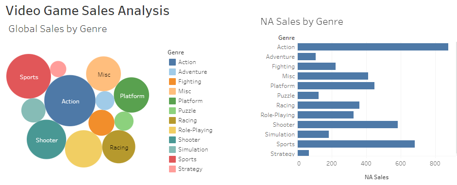
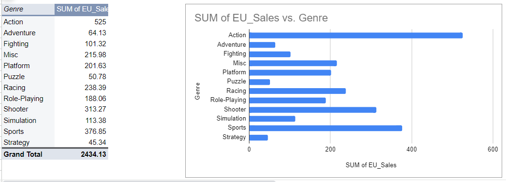

# Video Game Sales Analysis

---

## Project Overview

This project report presents an analysis aimed at determining how to increase sales for a video game company. The primary objective is to boost the company's revenue by enhancing video game sales. The study utilizes data from over 16,500 video games, including details such as the game's name, genre, release year, platform, publisher, and sales figures (in millions) across different regions: North America (NA) (the major hub), Europe (EU), Japan (JP), and the rest of the world. By examining this comprehensive dataset, the project seeks to identify trends and opportunities for strategic improvements to maximize sales performance.

## Tools

- Spreadsheet
-	Tableau

## Data Design / Cleaning / Preparation

The dataset contains a list of video games with sales exceeding 100,000 copies, sourced from a scrape of vgchartz.com and presented in an Excel sheet. The data was free of duplicates but contained blank cells. I addressed this by filtering and removing the blank cells using the "filter by condition" feature in Excel. The visualization tool employed in this project is Tableau, which helps create comprehensible data visualizations for professionals at any organizational level.

## Data Visualization / Findings

### Discover and engage with the rest of my visuals

The Spreadsheet Analysis. Access this [link](https://docs.google.com/spreadsheets/d/1K-BDqXsEQnCA652Jg8wwgQDMRWmPD-rQgKdQplmg3p0/edit?usp=sharing)

The Tableau Report. Access this [link](https://public.tableau.com/views/VideoGameSalesAnalysis_17230116399840/Dashboard1?:language=en-US&:sid=&:redirect=auth&:display_count=n&:origin=viz_share_link)

## Conclusion

Sales analysis is crucial for informed business decision-making. Based on my analysis, I recommend the following:
1. Since Action video games have a higher global demand, increase the supply of this genre more than others.
2. In Japan, Role-playing video games are the most preferred. I suggest increasing the supply of Role-playing, Action, and Sports video games in this market.
3. Consider raising the prices of some Action and Sports video games to capitalize on their high demand.

